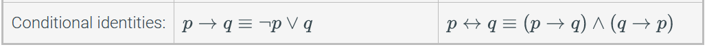
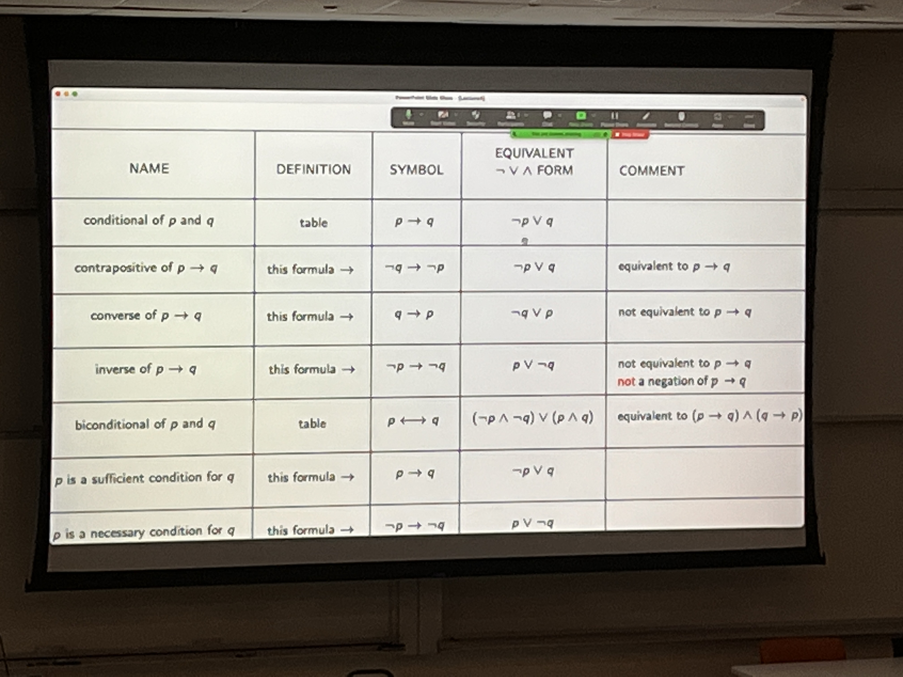
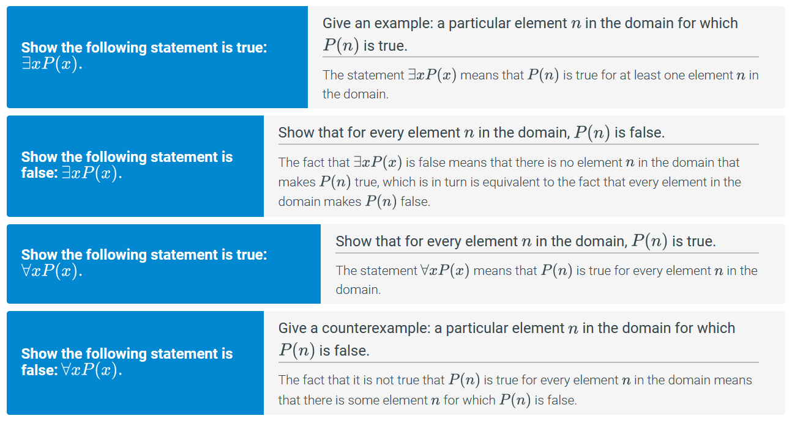
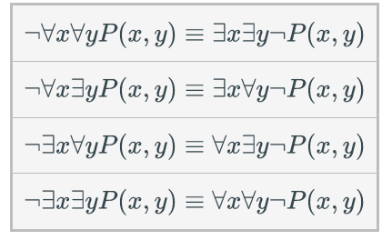
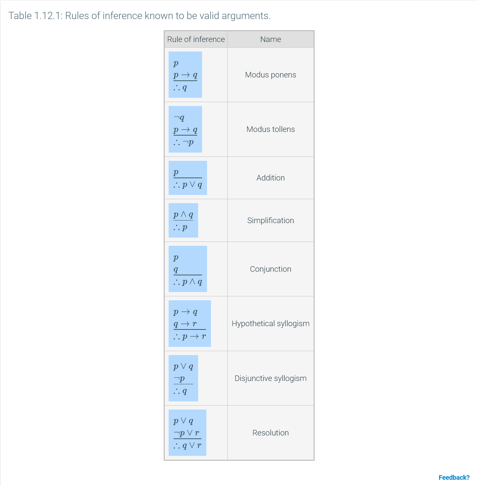
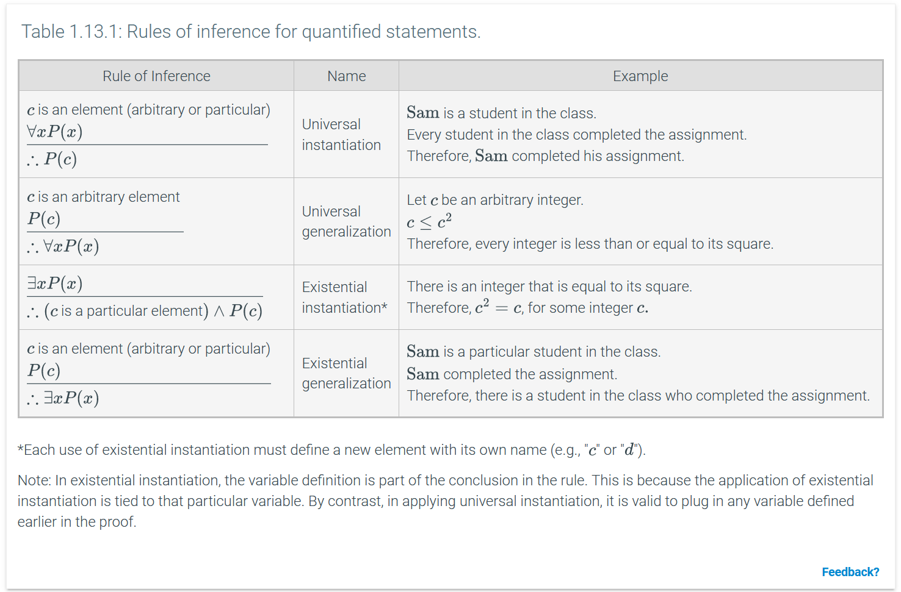

# Intro
- no late homework. you will be killed.
- two lowest labs, reading, and writing homework assignments get dropped at the end of semester.
- no formula sheets on exams.
- mandatory attendance (5% of grade).
- exams are 50% total of final grade.
- coding is the easiest part -- actually designing what you're coding is the hard part

# Scheme / DrRacket
- DrRacket seems to work exactly like IDLE
- everything is either an atom or a list
- he uses language Pretty Big, idk what difference it makes
## Atoms (primitive data types)
- integers
- real numbers (0.73, 3.17E+10)
- rationals (7/8, 11/3, -12/7)
- functions are done as such: `(+ 7/8 13/17)`
  - NOT like you want them to do it (`7/8 + 13/17`)
- symbols (x, y, x+y?, bad!)
  - names for data items and variables
  - you can actually use special symbols now
  - e.g.:
    ```scheme
    > (define x+y? 7)
    > x+y?
    7
    > x+y-
    x+y-: undefined;
    cannot reference an identifier before its definition
    > (define x+y- 8)
    > x+y-
    8
    ```
- booleans (#t, #f)
- strings ("alligator", "hello world!")
- characters (#\a, #\b)

## Built-in Operators
- +, -, *, / , abs, max, min
- usually work for >=2 operands
    ```scheme 
    > (+ 1 2 3 4 5 6 7 8 9 10)
    55
    > (* 1 2 3 4 5 6 7 8 9 10)
    3628800
    ```
- relational operators: `<` `>` `<=` `>=`
    ```scheme
    > (< 8 7)
    #f
    ```
    ```scheme
    > (= 8 (* 4 2))
    #t
    ```
- relational operators for more complex data types: `eq?` `eqv?` `equal?`
- logical operators `and` `or`  `not`
    ```scheme
    > (and (= 7 7) (< 8 7))
    #f
    > (or(= 7 7) (< 8 7))
    #t
    ```
## Built-in Predicates
- a function that returns a boolean value
- `number?` `integer?` `pair?` `boolean?` `string?`
    ```scheme
    > (number? 7)
    #t
    > (number? 7/12)
    #t
    > 
    > (number? "haha")
    #f
    ```

## Applying Functions
- `(function arg1 arg2 arg3 ... argN)`

## The List Data Type
- a sequence of objects within parentheses
- the interpreter always expects the first item to be a function
    ```scheme
    > (1 2 3 4)
    application: not a procedure;
    expected a procedure that can be applied to arguments
    given: 1
    > `(1 2 3)
    (1 2 3)
    > (quote (1 2 3))
    (1 2 3)
    > (define x (1 2 3))
    application: not a procedure;
    expected a procedure that can be applied to arguments
    given: 1
    > (define x `(1 2 3))
    > x
    (1 2 3)
    ```
- `cons` returns a given list with something prepended to it
- `car` returns the first item in the list
- `cdr` returns everything except he first item in it
- `length`
- `pair?` returns true if the list *is not* empty
- `null?` returns true if the list *is* empty

## Rules for Expression Evaluation
- numbers, strings, literals, all evaluate to themselves
- symbols are interpreted as variables, so they interpret to the value they represent
- lists:
    1. make sure the first element is a function (otherwise throws error)
    2. apply the function to everything in the list
    3. return the result
- a list of data interprets as itself
  - remember to use (quote 1 2 3) or `(1 2 3)

## Defining new functions
`(define (function-name param1 param2 ...) expr)`
we will implement
- arithmetic average `(x+y)/2`
- geometric average `sqrt(x*y)`
- harmonic average `2/((1/x)+(1/y))`
```scheme
(define (a-avg x y) (* 1/2 (+ x y)))
(define (g-avg x y) (sqrt (* x y)))
(define (h-avg x y) (/ 2 (+ (/ 1 x) (/ 1 y))))
```
```scheme
> (a-avg 20 30)
25
> (g-avg 20 30)
24.49489742783178
> (h-avg 20 30)
24
```

## Equality operators
```scheme
(= n m) ; checks whether n and m are equal in value
(eq? n m) ; identity operator - checks if n and m point to the same place in memory
          ; works for literals
(eqv? n m) ; checks if n and m are numbers --
           ; if so it returns (= n m), otherwise returns (eq? n m)
(equal? n m) ; checks if n and m form structures with the same components -- 
             ; i.e. are lists whose corresponding elements are equal.
```
```scheme
> (define x 2)
> (define y 2)
> (eq? x y)
#t
```
you can do this because 2 is stored in the same memory location no matter what variable is pointing to it

```scheme
> (define x `(2 3))
> x
(2 3)
> (define y `(2 3))
> y
(2 3)
> (eq? x y)
#f
> (equal? x y)
#t
```
the lists point to different memory locations, but their elements are equal.

# Logic
- Logic is a study of arguments
- Arguments are a sequence of statements whose purpose is to establish the truth of an assertion.
- those statements are *premises*, except for the last one which is a *conclusion*
- a proposition will be true or false always
  - "It is raining" is a valid proposition
  - "What time is it?" is obviously not a proposition
- two boolean formulas are considered equivalent if they have the same formulas
  - implies that their truth tables are the same

## Compound Propositions
for valid propositions p and q, these are valid propositions
- ¬p (~p)
  - not p
- p ∨ q
  - p or q
  - disjunction
- p ∧ q
  - p and q
  - conjunction
- p → q (p => q)
  - p then q
  - implication / conditional
  - p = hypothesis, q = consequence
  - uncommon versions:
    - p only if q = p → q
    - p unless q = ¬q → p = p ∨ q
  - p → q = ¬q ∨ p
- p ↔ q (p ⇔ q)
  - p iff q
  - biconditional / equivalence


# Conditionals
```scheme
(if (condition) "runs if true" "runs if false")
(cond [(condition1) "true"] [(condition2) "true"] [else "runs for else"])
```
the basics:
```scheme
> (if (< 1 2) "less" "more")
"less"
> (if (< 3 2) "less" "more")
"more"
> (define x 6)
> (cond [(eq? x 1) "its 1"] [(eq? x 2) "its 2"] [else "something else"])
"something else"
> (define x 1)
> (cond [(eq? x 1) "its 1"] [(eq? x 2) "its 2"] [else "something else"])
"its 1"
> (define x 2)
> (cond [(eq? x 1) "its 1"] [(eq? x 2) "its 2"] [else "something else"])
"its 2"
```


let's try to implement a function like python's `filter()` recursively:
```scheme
(define (apply-pred list pred)
  (cond 
    [(null? list)
      `()]
    [(pred (car list))
      (cons (car list) (apply-pred (cdr list) pred))]
    [else
      (apply-pred (cdr list) pred)]))
```
- we're using `cond` because there are 3 possible branches -- the list is empty, the current item is caught by the filter, and the current item is not caught by the filter.

# Boolean Math



- for some laws, multiplication = AND and addition = OR
- p implies q ≡ (not p) or q
- not(p implies q) ≡ p and (not q)
- the contrapositive of a statement is always equivalent to its original statement
  - (p → q) is logically equivalent to (not q → not p)
- ¬(p → q) ≡ p ∧ ¬q
- a *recognizer expression* is only true for one single input
  - we are doing minterm expansion i am not taking these notes again
- CNF - conjunctive normal form
  - a lot of disjunctions connected by ands
- DNF - disjunctive normal form
  - a lot of conjucntions connected by ors


# Predicate / First Order Logic
## symbols
- ∈ = belongs to / is an element of
- ℤ = set of integers
  - ℤ⁺ = all positive integers (excl. 0)
- ℝ = set of all real numbers
- ℚ = set of all rational integers
  - recall scheme handles fractions well
- ∀ = for all - universal quantifier
- ∃ = there exists - existential quantifier
- 3 ∈ ℤ
- 3.2 = 16/5 ∉ ℤ

## Predicate Logic
- recall a predicate is a ststement that only returns true or false
- a predicate functon contains a finite number of variables and indicates whether a relationship is held by the objects represented b ythose variables.
  - when you fill in the variables with objects it becomes a proposition
  - a predicate has a variable and a domain and as such has no inherent truth value vs.
  - a proposition does not contain any variables and as such has a set truth value
- the domain is the set of all variables for which it is defined, i.e. all that make sense
- ex
  - Let D = {1,2,3,4,5} and consider ∀x (x² >= x)
  - Is this statement true?
  - yes. do the math and work through the domain.
- Existential Quantifier ex.
  - Let P(x) = "x² -4 > x" be a predicate with a domain consisting of all real numbers
  - ∃x P(x) (there exists an x for P(x) that makes P(x) true)
  - True! (10, per se)
- ∀x<0 (x² > 0)
  - for all x that are <0, are any x² > 0?
  - also ∀x(x < 0 → x² > 0)
- the input that makes a predicate false is the counterexample
- proving or disproving universally/existentially quantified statements
  
- usually you have to prove a ∃ statement true, vs proving a ∀ statement false 


## Quantified statements
- doing logic with predicates
- the quantifiers have higher precedence than all other operators
- you cannot do (∀xP(x)) ∨ Q(x) because now x is both bound and free (illegal)
- the variable x in P(x) is a *free variable*
  - you cannot do any calculus with this because we don't know what to do with x
- in ∀xP(x), x is now a *bound variable* bc it is bound to the quantifier
  - now we can evaluate it
- though you can do ∀x(P(x) ∨ Q(x)), because ∀x binds both occurences of x
- DeMorgan's law for quantified statements:
  - ¬(∀y Q(y)) = ∃y ¬Q(y)
  - ¬(∃z R(z)) = ∀z ¬R(z)
- quantifiers are sorta distributive:
  - ∃xP(x) ∨ ∃xQ(x) ≡ ∃x(P(x) ∨ Q(x))
  
### Lab examples
- Given P(x) with domain 1, 2, 3, 4, 5:
  - ∃xP(x) ≡ P(1) ∨ P(2) ∨ P(3) ∨ P(4) ∨ P(5)
  - ∀xP(x) ≡ P(1) ∧ P(2) ∧ P(3) ∧ P(4) ∧ P(5)
  - ¬∃xP(x) ≡ ¬(P(1) ∨ P(2) ∨ P(3) ∨ P(4) ∨ P(5)) 
    - ≡ ¬P(1) ∧ ¬P(2) ∧ ¬P(3) ∧ ¬P(4) ∧ ¬P(5) ≡ ∀xP(x)
- given P(x) = ∀x(x² > x)
  - ¬P(x) ≡ ∃x(x² ≤ x>)
  - when negating a inequality operator, it toggles the direction *and* its "or equal to"
- 

### Nested Quantifiers
- Consider:
- M(x,y): x sent an email to y.
  - ∀x∀yM(x,y) ≡ everyone sent an email to everyone (including themselves)
  - ∃x∃yM(x,y) ≡ someone sent an email to someone (possibly themselves)
  - ∃x∀yM(x,y) ≡ someone sent an email to everyone (including themselves)
  - ∀x∃yM(x,y) ≡ everyone sent an email to someone (possibly themselves)
- the existential quantifier is trying to make the statement true
  - only needs one to be true
- the universal quantifier is trying to make it false
  - only needs one to be false
- DeMorgan's law still works, it just swaps all of the nested quantifiers

  - you can do it to one quantifier at a time if necessary, but you will probably always do the whole thing
- bringing back M(x,y): x sent an email to y.
  - what if we want to say everyone sent an email to everyone else, but not themselves?
  - ∀x∀y((x≠y) ∧ M(x,y)) ≡ everyone sent an email to everyone *except themselves*
- consider L(x): x was late to the meeting
  - we want to say that only one person was late to the meeting
  - ∃x(L(x) ∧ ∀y((x≠y) → ¬L(y)))
- ∀_x,yP(x,y) ≡ ∀x∀yP(x,y)

# Inference Rules
- an argument form is a sequence of formulas (preceding premises) the last of which is called the conclusion
  - premises are also called hypotheses
- argument form is valid if, when all of the premises are true, the conclusion is also true.
- p1, p2, ..., pn, ∴q is a valid argument iff p1 ∧ p2 ∧ ... ∧ pn → q is true
- syllogisms have two premises and a conclusion
- Modus Ponens:
  - p → q
  - p
  - ∴q
    - ≡ (p → q) ∧ p → q ≡ T
- Modus Tollens
  - p → q
  - ¬q
  - ∴¬p
- you can change order of premises
- you can replace or add a proposition equivalent to any premise
- when using a truth table
  - prove the conclusion true by finding all rows where all hypotheses are true AND the conclusion is true.
  - if there are any rows with a truth mismatch between any hypotheses and the conclusion than the argument is false.
- usually when they ask to prove that an argument is invalid, they want to to prove that there is some case where all of the hypotheses are true but the conclusion is false. 




# Set Theory
- A set is a well-defined collection of objects
- set builder notation: \{x ∈ ℤ+ | x <= 4\}
  - the set of all x in the se tof positive integers where x is less than or equal to 4
- set roster notation: \{1, 2, 3, 4\}
- a set whose elements can be explicitly listed is a finite set
  - i.e. the set of prime numbers
  - cardinality = |set| = amount of unique values
  - any others are infinite sets
    - cardinality of infinity
- order is irrelevant; membership is important
  - \{1, 2, 3\} = \{3, 1, 2\}
- \{0\} ~= 0
  - a set and object are two different things
  - a set contains objects
- a subset contains any amount of elements from another set and none that are not in that other set
  - a PROPER subset contains any amount of elements from another set but NOT all of them and none that are not in the other set.
  - if a set is a proper subset of another set, then it is also a regular subset of it too. not  vice versa.
- the power set of A, P(A), is the set of all subsets of A
  - A = \{1, 2, 3\}
  - P(A) = \{∅, \{1\}, \{2\}, \{3\}, \{1, 2\}, \{1,3\} \{2,3\}, \{1,2,3\}\}
  - a set's power set has 2^(|set|) elements
- the intersection of two sets is the set of all elements they have in common
- the union of two sets is the set of the contents of both sets
- set difference: A - B or A \ B = {x ∈ U | x ∈ A and x ∉ B}
  - A \ B = A ∩ B̄ 
- 