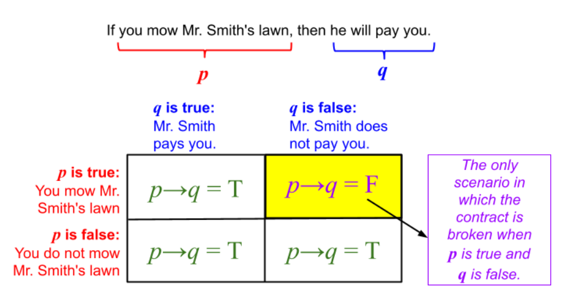
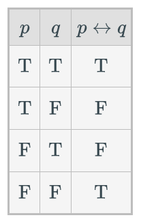

## symbol table
- not ¬
- and ∧
- or ∨
- xor ⊕
- logically equivalent to ≡
- proposes →
- iff ↔ biconditional arrow
- requires ⇔ iff double arrow

# Propositional Logic 1
- The conjunction symbol ∧ is AND.

- The disjunction symbol ∨ is inclusive OR.

- XOR looks the same ⊕.
  - XOR and OR are nearly the same except T XOR T = F whereas T OR T = T.
- negation symbol NOT ¬ toggles its input.
- order of operations:
1. fill in actual truth values
2. parentheses
3. not ¬
4. and ∧
5. or ∨

- when filling in a logic table
  - amount of rows = 2^(amt of variables)
  - rightmost row alternates TFTF...
  - then TTFF
  - then TTTTFFFF
  - etc. (keep doubling the amount of T/F)

- given p implies q (p -> q), the only way it can return false is if p is T and q is F.

  - p is the hypothesis, q is the conclusion
  - in this way, a conditional statement will always return true if the hypothesis p is false
    - if you don't mow the lawn, Mr. Smith can pay you or not and it doesn't matter. this always returns T.
    - if you mow the lawn and he pays you then the contract is fulfilled and it returns T.
    - if you *do* mow the lawn and he *doesn't* pay you, the contract is broken and the statement returns false.
    - i.e. True -> False is the only way to make it return F.

here's a table for the converse, contrapositive, and inverse of a conditional statement.

- biconditional statements like p ↔ q require both to be the same to return T.
  - if p and q return T. if not p and not q then return T. else return F.

- apparently you can use p ⇔ q to denote that p = q (and therefore p ↔ q = T) but i don't think the book ever does

# Propositional Logic 2

- a tautology is always correct, regardless of the input
  - p ∨ ¬p = T no matter the value of p
  - p ∧ q -> p = T
- a contradiction is always false, regardless of the input
  - p ∧ ¬p = F no matter the value of p
- apparently logical equivalence is supposed to be ≡ but i'm using =. i don't have ≡ on my keyboard.
  - two things are logically equivalent if, for every possible combination of inputs, output the same values
  - you can prove this by making a logic table and putting the things you want to prove equivalent next to each other

